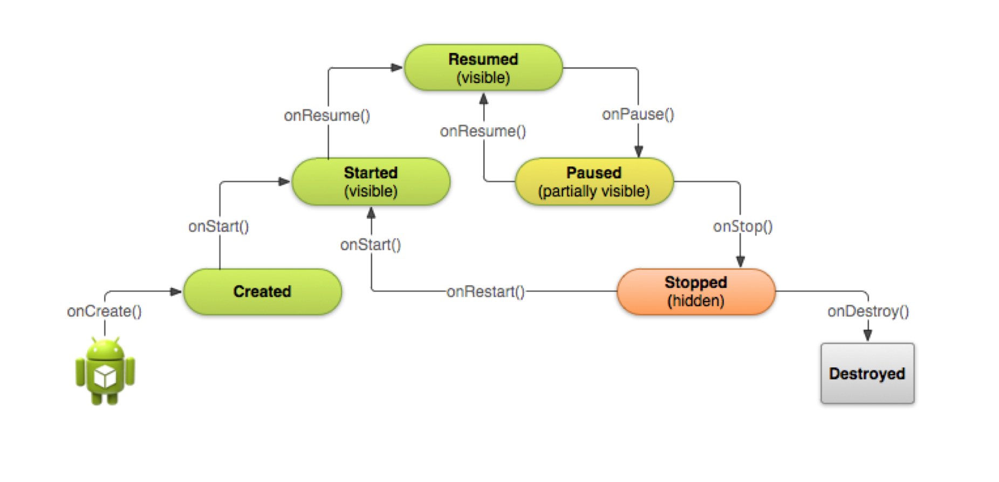

- **어플리케이션** : 한 개 이상의 액티비티들로 구성된다. 액티비티들은 애플리케이션 안에서 느슨하게 묶여 있다.
- **태스크** : 스택에 있는 액티비티
- **액티비티 스택** : back키를 누르면 현재 액티비티를 제거하고 이전 액티비티로 되돌아간다. 사용자가 방문한 액티비티들은 어딘가에 기억
- **인텐트** : 각각의 화면은 별도의 액티비티로 구현되는데, 다른 액티비티로 전환할 때 인텐트가 필요하다. 전환 시 액티비티의 실행에 필요한 여러 가지 정보들을 보내주어야 한다. 이 때 정보를 인텐트에 실어서 보낸다. 

인텐트로 액티비티들을 만들고 메니페스토 파일을 수정해 주어야 한다. 

## 인텐트의 종류 

### 명시적 인텐트 (explict intent) 
"애플리케이션 A의 컴포넌트 B를 구동시켜라"와 같이 명확하게 지정

    ```java
    Intent intent = new Intent(this, NextActivityname.class);
    startActivity(intent);
    ```

**액티비티에서 결과 받기**

MainActivity.java
```java
public class MainActivity extends Activity {
    //서브 액티비티를 시작한다.
    Intent in = new Intent(MainActivity.this, SubActivity.class);
    startActivityForResult(in, COMMAND);

    @Override
    protected void onActivityResult(int requestCode, int resultCode, Intent data) {
        //여기서 값을 전달받는다. 
    }
}
```

- **값을 읽어오는 메소드** (MainActivity->Intent) 
    - int getIntExtra(String name, int defaulValue)
    - float getFloatExtra(String name, float defaultValue)
    - int[] getIntArrayExtra(String name)
    - String getStringExtra(String name)

- **값을 저장하는 메소드** (SubActivity->Intent)
    - putExtra(String name, int value)
    - putExtra(String name, flaot value)
    - putExtra(String name, int[] value)
    - putExtra(String name, String value)


### 암시적 인텐트** (implicit intent) : 
"지도를 보여줄 수 있는 컴포넌트이면 어떤 것이라도 좋다."

    ```java
    Intent intent = new Intent(Intent.ACTION_SEND);
    intent.putExtra(Intent.EXTRA_EMAIL, recipientArray);
    startActivity(intent);
    ```

**액션의 종류**

- ACTION_VIEW : 데이터를 사용자에게 표시
- ACTION_EDIT : 사용자가 편집할 수 있는 데이터 표시
- ACTION_MAIN : 태스크의 초기 액티비티로 설정
- ACTION_CALL : 전화통화 시작
- ACTION_SYNC : 모바일 장치의 데이터를 서버의 데이터와 일치시킨다. 
- ACTION_DIAL : 전화번호를 누르는 화면 표시


## 액티비티 생애주기
